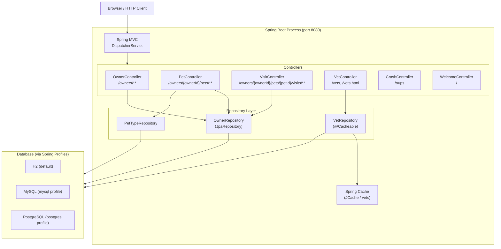

# Architecture Overview

## Purpose

Spring PetClinic is a Spring Boot reference application modeling a veterinary clinic. It demonstrates layered MVC architecture, JPA repositories, caching, internationalization, and multiple database profiles.

## Component Overview



## Controllers

| Controller | Package | Routes |
|---|---|---|
| OwnerController | org.springframework.samples.petclinic.owner | GET/POST `/owners/new`, GET/POST `/owners/{ownerId}/edit`, GET `/owners/find`, GET `/owners`, GET `/owners/{ownerId}` |
| PetController | org.springframework.samples.petclinic.owner | GET/POST `/owners/{ownerId}/pets/new`, GET/POST `/owners/{ownerId}/pets/{petId}/edit` |
| VisitController | org.springframework.samples.petclinic.owner | GET/POST `/owners/{ownerId}/pets/{petId}/visits/new` |
| VetController | org.springframework.samples.petclinic.vet | GET `/vets.html` (paginated HTML view), GET `/vets` (JSON response body) |
| CrashController | org.springframework.samples.petclinic.system | GET `/oups` |
| WelcomeController | org.springframework.samples.petclinic.system | GET `/` |

## Repository Layer

| Repository | Entity | Notes |
|---|---|---|
| OwnerRepository | Owner | Extends `JpaRepository<Owner, Integer>`; supports paginated last-name prefix search via `findByLastNameStartingWith` |
| VetRepository | Vet | Extends `Repository<Vet, Integer>`; both `findAll()` overloads annotated `@Cacheable("vets")` |
| PetTypeRepository | PetType | Provides `findPetTypes()` used to populate pet-type dropdowns |

## Caching Strategy

- `@Cacheable("vets")` is applied to both `VetRepository.findAll()` overloads (collection and paginated).
- The `"vets"` cache is created and configured in `CacheConfiguration` (`src/main/java/.../system/CacheConfiguration.java`) using the JCache API (`JCacheManagerCustomizer`), with statistics enabled.
- `@EnableCaching` is declared on `CacheConfiguration`.
- The default cache provider is the JCache-compatible in-memory implementation bundled with Spring Boot (Ehcache or Caffeine depending on classpath); no external cache server is required.

## Internationalization (i18n)

- Message bundles are located in `src/main/resources/messages/`.
- Supported locales: English (default — `messages.properties`, `messages_en.properties`), German (`messages_de.properties`), Spanish (`messages_es.properties`), Farsi (`messages_fa.properties`), Korean (`messages_ko.properties`), Portuguese (`messages_pt.properties`), Russian (`messages_ru.properties`), Turkish (`messages_tr.properties`).
- `WebConfiguration` (`src/main/java/.../system/WebConfiguration.java`) registers a `SessionLocaleResolver` (defaults to `Locale.ENGLISH`) and a `LocaleChangeInterceptor` that reads the `?lang=` query parameter.
- `spring.messages.basename=messages/messages` is set in `application.properties`.

## Database Profiles

| Profile | Database | Activation |
|---|---|---|
| (default) | H2 in-memory | No profile flag needed |
| `mysql` | MySQL | `--spring.profiles.active=mysql` |
| `postgres` | PostgreSQL | `--spring.profiles.active=postgres` |

Schema and seed data SQL files are located in `src/main/resources/db/`:

- `src/main/resources/db/h2/schema.sql` and `data.sql`
- `src/main/resources/db/mysql/schema.sql` and `data.sql`
- `src/main/resources/db/postgres/schema.sql` and `data.sql`

Spring Boot loads the appropriate files at startup via:

```properties
spring.sql.init.schema-locations=classpath*:db/${database}/schema.sql
spring.sql.init.data-locations=classpath*:db/${database}/data.sql
spring.jpa.hibernate.ddl-auto=none
```

## Spring Actuator

- Actuator endpoints are enabled and all endpoints are exposed via `management.endpoints.web.exposure.include=*` in `application.properties`.
- Accessible at `/actuator` (e.g., `/actuator/health`, `/actuator/info`, `/actuator/metrics`).
- **Note:** Exposing all endpoints is appropriate for development/testing only; restrict in production.

## Kubernetes

- Kubernetes manifests are present in the `k8s/` directory.
- `k8s/petclinic.yml` — Deployment and Service for the application.
- `k8s/db.yml` — Deployment and Service for the database backend.
- Supports deployment of the application with MySQL or PostgreSQL backend via profile configuration.
