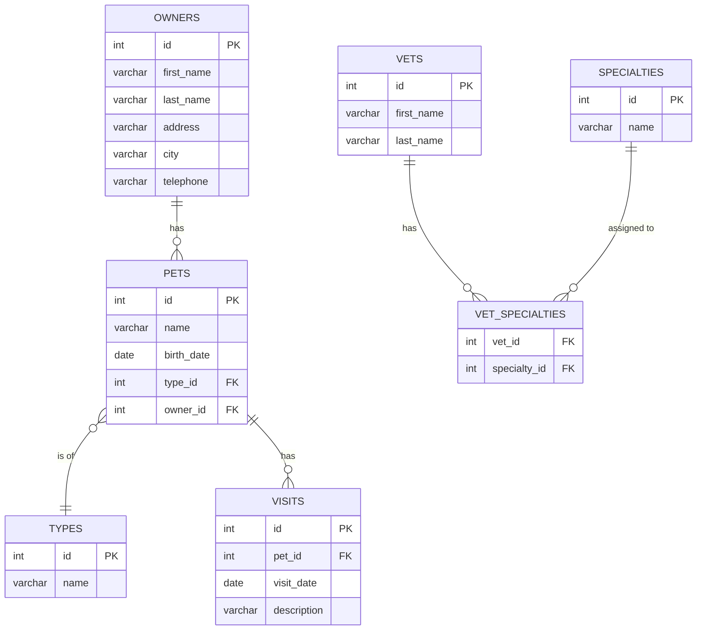

# Data Model

## Entity Relationship Diagram



## Table Descriptions

| Table | Description | Key Constraints |
|---|---|---|
| `owners` | Pet owners / clients of the clinic | `telephone` NOT NULL; `last_name` uses case-insensitive collation in H2 (`VARCHAR_IGNORECASE`) |
| `pets` | Pets belonging to owners | `owner_id` NOT NULL (FK → `owners`), `type_id` NOT NULL (FK → `types`) |
| `types` | Pet type lookup (cat, dog, hamster, etc.) | `name` NOT NULL; indexed |
| `visits` | Scheduled clinic visits per pet | `visit_date` NOT NULL; `pet_id` FK → `pets`; indexed on `pet_id` |
| `vets` | Veterinarians on staff | `last_name` indexed |
| `specialties` | Vet specialty lookup (radiology, surgery, etc.) | `name` NOT NULL; indexed |
| `vet_specialties` | Many-to-many join table for vets and specialties | Composite FK: `vet_id` → `vets`, `specialty_id` → `specialties` |

## JPA Class Hierarchy

```
BaseEntity                          (model package — provides @Id Integer id)
├── NamedEntity extends BaseEntity  (model package — adds String name)
│   ├── PetType extends NamedEntity (owner package)
│   └── Specialty extends NamedEntity (vet package)
├── Person extends BaseEntity       (model package — adds firstName, lastName)
│   ├── Owner extends Person        (owner package — adds address, city, telephone, @OneToMany pets)
│   └── Vet extends Person          (vet package — adds @ManyToMany specialties)
├── Pet extends NamedEntity         (owner package — adds birthDate, @ManyToOne type, @OneToMany visits)
└── Visit extends BaseEntity        (owner package — adds date, description)
```

- **`BaseEntity`** — `@MappedSuperclass`; provides `id` (`@Id @GeneratedValue IDENTITY`) and `isNew()` helper.
- **`NamedEntity`** — `@MappedSuperclass`; adds `name` field; used by `PetType` and `Specialty`.
- **`Person`** — `@MappedSuperclass`; adds `firstName` and `lastName` (both `@NotBlank`, max 30 chars); used by `Owner` and `Vet`.
- **`Owner`** — `@Entity @Table("owners")`; adds `address`, `city`, `telephone` (`@NotBlank`; telephone validated against `\d{10}`); holds `@OneToMany(cascade=ALL, fetch=EAGER)` `pets` list.
- **`Pet`** — `@Entity @Table("pets")`; adds `birthDate` (`LocalDate`); `@ManyToOne` `type` (PetType); `@OneToMany(cascade=ALL, fetch=EAGER)` `visits` set ordered by date ASC.
- **`Visit`** — `@Entity @Table("visits")`; adds `date` (`LocalDate`, defaults to tomorrow on construction) and `description` (`@NotBlank`).
- **`Vet`** — `@Entity @Table("vets")`; adds `@ManyToMany(fetch=EAGER)` `specialties` via join table `vet_specialties`.
- **`PetType`** — `@Entity @Table("types")`; inherits `id` and `name` from `NamedEntity`.
- **`Specialty`** — `@Entity @Table("specialties")`; inherits `id` and `name` from `NamedEntity`.

## Key JPA Relationships and Fetch Strategies

| Relationship | Type | Fetch | Cascade |
|---|---|---|---|
| `Owner` → `Pet` | `@OneToMany` | `EAGER` | `ALL` |
| `Pet` → `Visit` | `@OneToMany` | `EAGER` | `ALL` |
| `Pet` → `PetType` | `@ManyToOne` | `EAGER` (default for `@ManyToOne`) | none |
| `Vet` → `Specialty` | `@ManyToMany` | `EAGER` | none |

> **Note:** Eager fetching is used throughout for simplicity in this reference application. In a production application with large datasets, consider switching to `LAZY` fetching and using explicit join fetches where needed.

## Schema SQL Locations

| Database | Schema | Seed Data |
|---|---|---|
| H2 (default) | `src/main/resources/db/h2/schema.sql` | `src/main/resources/db/h2/data.sql` |
| MySQL | `src/main/resources/db/mysql/schema.sql` | `src/main/resources/db/mysql/data.sql` |
| PostgreSQL | `src/main/resources/db/postgres/schema.sql` | `src/main/resources/db/postgres/data.sql` |

Spring Boot selects the correct files at startup using the `database` property (defaulting to `h2`) set in `application.properties`:

```properties
database=h2
spring.sql.init.schema-locations=classpath*:db/${database}/schema.sql
spring.sql.init.data-locations=classpath*:db/${database}/data.sql
spring.jpa.hibernate.ddl-auto=none
```
