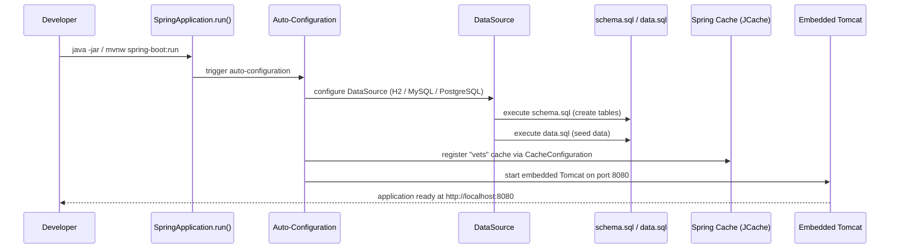
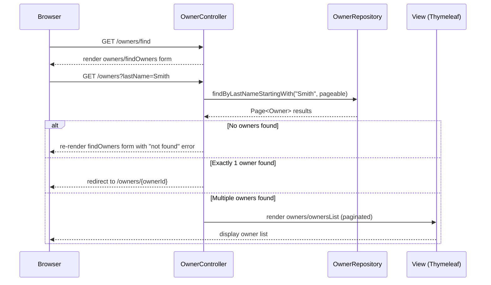
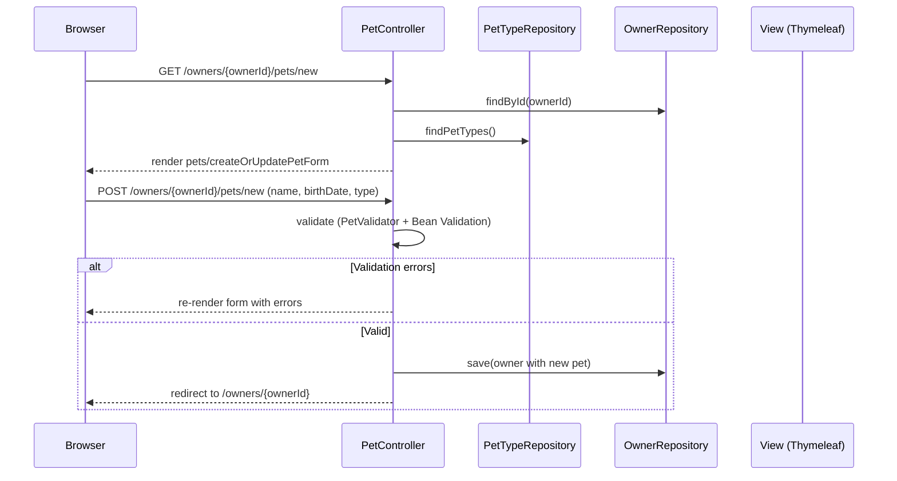
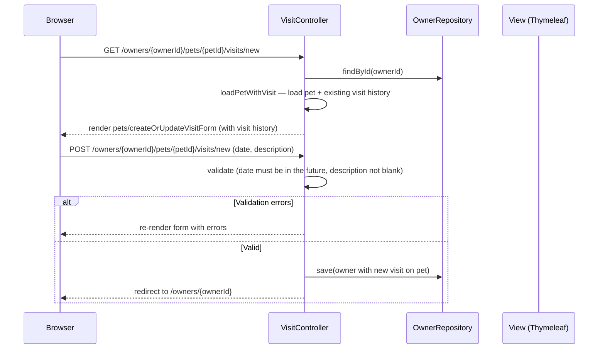
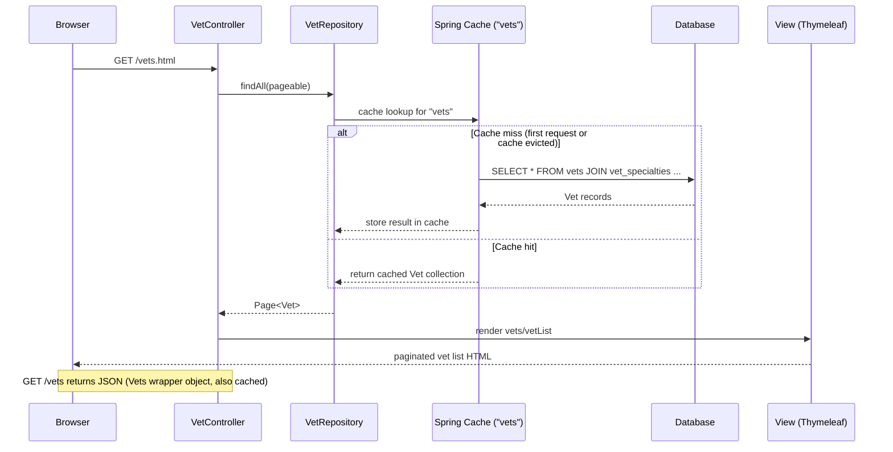
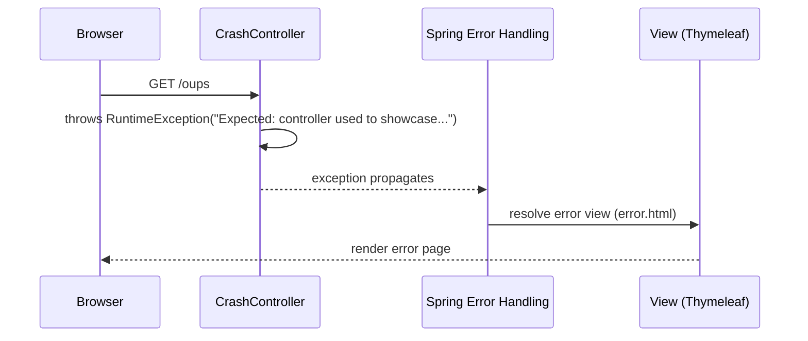
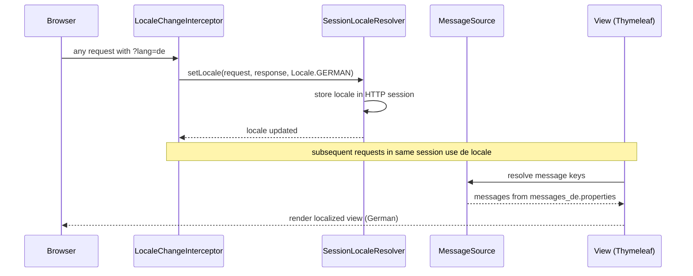
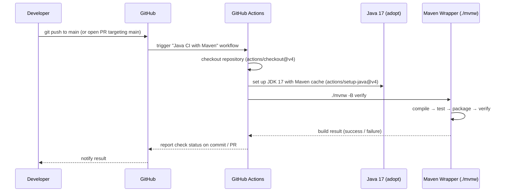

# Key Workflows

## 1. Application Startup

## 2. Owner Search Flow

## 3. Add New Pet

## 4. Book a Visit

## 5. Vet List with Caching

## 6. Error Handling

## 7. Locale Switching

## 8. CI Pipeline

